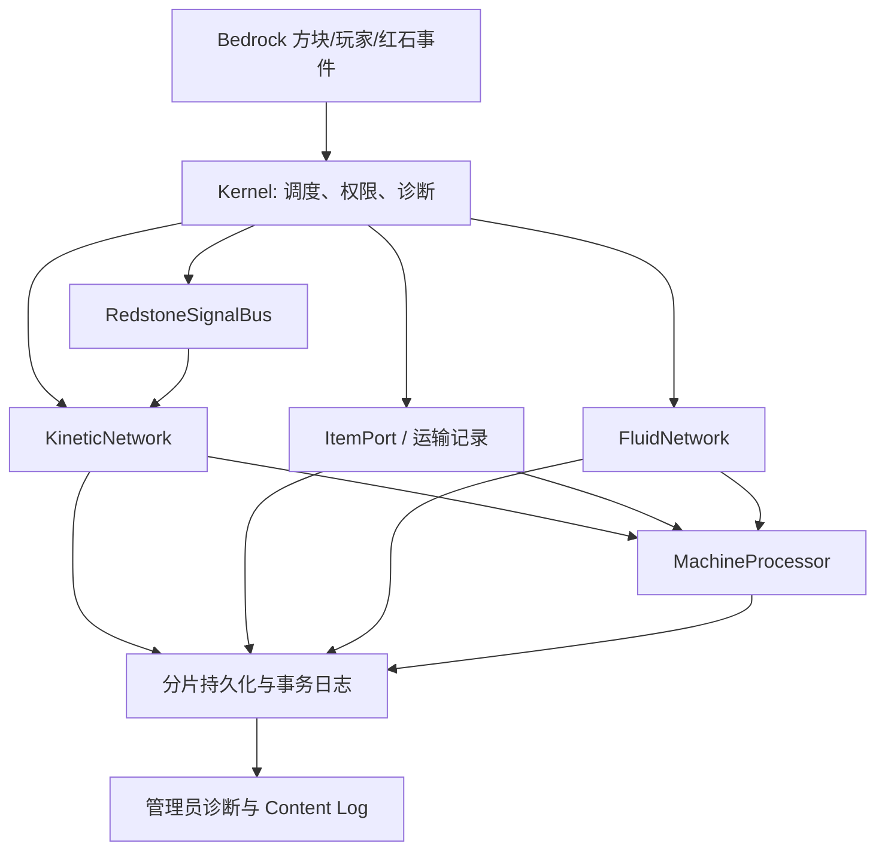

# Create Bedrock 阶段 3 完整详细设计

**状态：** S3-7 至 S3-14 的静态收敛已完成，S3-15 的验收账本与性能基线已落地；阶段 3 的 Windows/Realm/PS 物理平台验收仍未完成

**关联总规划：** `Create Bedrock / Realm 完整迁移规划与设计`

**目标基线：** Create 6.0.11 / Java 1.21.1；Bedrock 行为包当前声明最低 1.21.80
**阶段目标：** 完成静态系统的可扩展实现：动力、加工、基础物流、流体、红石，以及对应内容、配方、资源和迁移矩阵。

## 1. 阶段定义与完成条件

阶段 3 是“静态系统”阶段，不是完整 Create 发布阶段。它只处理固定在世界中的方块、物品、容器和网络；移动机械、蓝图和机械 actor 属于阶段 4，信号调度、包裹物流和高级列车属于阶段 5。

阶段 3 完成必须同时满足：

1. 已纳入阶段 3 的每个 Java identifier 都有规格、Bedrock identifier、资源清单、行为实现、存档版本和测试项。
2. 基础动力、加工、物流、流体和红石可以在服务端权威脚本中运行；任一脚本异常不得复制或吞没物品、流体或机器状态。
3. 源配方中属于已实现内容的条目全部有“已迁移”或明确的“平台阻塞”结论，不能以未分类条目代替完成。
4. Node 单测、包校验和构建通过；Windows、Realm、PS 的验收项须记录为待测，不能因当前没有环境而标为通过。

阶段 2 的 Windows/Realm/PS 硬闸门仍未验证。因此本阶段可以继续编码，但不得据此声称移动机械、列车或 Realm 已可发布。

## 2. 当前基线与范围校正

当前迁移矩阵有 362 个主注册项：185 个方块、114 个方块实体、54 个物品和 9 个实体。仅 30 个处于 `implementation_in_progress`，332 个仍为 `specification_pending`。仓库还识别到 1,884 个配方、2,449 个源资源和 2,567 个生成资源。

现有 Bedrock 包已提供手摇曲柄、水车、轴、齿轮、离合器、磨盘、压力机、粉碎轮、16 方块轴承原型及最小列车原型。它们是阶段 2 风险验证的基础，不等同于阶段 3 的全量实现。

现有矩阵没有 `phase` 字段，导致阶段 3 的通过条件无法准确计算：其中包含本应在阶段 4、5 实现的移动机械和列车内容。矩阵必须升级为 schema v2，并为每条记录增加下列字段：

```json
{
  "phase": 3,
  "domain": "logistics",
  "status": "specification_confirmed",
  "bedrockIdentifier": "createbedrock:andesite_funnel",
  "behaviorPath": "behavior_pack/scripts/logistics/funnel-runtime.js",
  "persistenceSchema": 1,
  "resourceStatus": "pending",
  "acceptanceId": "LOG-FUNNEL-001",
  "blockingReason": null
}
```

状态只允许为 `specification_pending`、`specification_confirmed`、`implementation_in_progress`、`static_verified`、`realm_accepted` 和 `blocked`。`blocked` 必须带原因、替代方案和重新评估版本；阶段 3 的统计只计算 `phase: 3`。

## 3. 范围

| 子系统 | 阶段 3 包含 | 后续阶段，不在本阶段声明完成 |
|---|---|---|
| 内核 | 调度、分片持久化、事务、诊断、迁移矩阵 | 全 Realm 压力调优与发布回滚演练 |
| 动力/加工 | 固定动力件、固定加工机、静态配方 | 附着在移动机械上的 actor |
| 物流 | ItemPort、传送带、漏斗、隧道、chute、depot、筛选和基础包裹接口 | 机械臂、移动库存、高级包裹路由 |
| 流体 | 储罐、管道、泵、固定端口、原版水/岩浆适配 | 软管滑轮、移动流体装置 |
| 红石 | 固定输入/输出、离合器和静态控制件 | 移动接触器、列车信号调度 |
| 资源 | 第一版直接转换/引用 Java 资源、语言、配方 | 重做模型、动画与教学体验 |

阶段 3 不允许为降低工作量而删除 Create 行为；尚不能实现的能力必须保留在矩阵中并标为阻塞，而非伪装为完成。

## 4. 目标架构



所有决定物品、流体、速度、配方、碰撞和存档的逻辑都在行为包服务端执行。资源包只负责模型、贴图、动画、语言和可视状态；客户端不得拥有可导致不同步或复制物品的权威状态。

### 4.1 调度与预算

`kernel` 为每类工作维护独立队列，使用稳定的轮转顺序。最低任务组为 `persistence`、`kinetics`、`processing`、`logistics`、`fluids`、`redstone` 和 `cleanup`。每组每 tick 都有固定预算；遍历连通网络、扫描配方或清理运输记录必须拆成可恢复的小任务，禁止全世界扫描。

每个任务必须是幂等的：同一任务重复执行不重复扣除物品或流体。任何异常由调度器记录为诊断并隔离，不能中断其他组。每个子系统至少上报队列长度、活跃节点数、延迟任务数、失败次数和最近错误。

### 4.2 分片持久化

当前原型把动力、列车、移动结构和机器列表分别写入单一 World Dynamic Property。阶段 3 必须改为 `ShardedStateStore`；现有 `DeferredPersistence` 继续负责 20 tick 合并写入和异常重试。

每个持久化域使用两代提交：

```text
createbedrock:state_root_v1              # 小型根指针，仅保存活跃 generation
createbedrock:state_g<generation>_i<n>   # 固定大小的索引页
createbedrock:state_g<generation>_s<n>   # 有校验和的数据分片
```

写入顺序为：生成新数据分片 → 写入索引页 → 最后更新根指针。根指针是提交点；任一步失败时恢复逻辑仍读取上一代已提交索引。成功后，`cleanup` 组异步删除旧 generation。每个数据分片采用项目保守上限 12 KiB 字符串预算，不依赖未验证的平台极限；超过预算即继续分割，并在诊断中报警。

分区规则如下：

- 动力节点、机器、端口、流体储罐：`dimension + 16×16×16 section`。
- 皮带、管道连接：按字典序较小端点所在 section 保存，避免双写。
- 静态移动结构快照：按轴承锚点 section 保存；超过分片预算时按部件序号拆分。
- 运输中的物品和流体：按当前运输 section 保存；事务日志单独按事务 id 分片。
- 轨道图维持既有 chunk 图结构；阶段 5 将其接入同一分片存储，不在阶段 3 重写列车行为。

每个分片封装为：

```json
{
  "schemaVersion": 1,
  "domain": "logistics",
  "partition": "minecraft:overworld:3:-2:4",
  "revision": 42,
  "checksum": "deterministic-content-hash",
  "records": []
}
```

恢复时先校验 schema、分区、校验和和记录类型；单个坏分片只冻结受影响的节点并输出诊断，不清空同域其他分片。首次升级必须读取旧 `*_v1` 单属性快照，生成新分片并仅在根指针提交后删除旧键。迁移需要覆盖“中断在写入前、索引前、根提交后”三种测试。

### 4.3 物品事务与基础物流

物流的核心不是直接在脚本里复制 `ItemStack`，而是 `ItemPort` 和持久化 escrow（托管）记录。端口适配器覆盖原版容器、Create 容器、depot、传送带入口/出口、漏斗和 chute。每个端口暴露：

```text
inspect() -> 可读槽位快照和 revision
reserve(request) -> 不改变库存的候选计划
extract(reservation) -> 取得托管物品或失败
insert(escrow) -> 接收全部或部分物品
rollback(escrow) -> 回到原端口或安全缓冲区
```

一次转移按以下状态机运行：

1. 读取源端口、目标端口和过滤器，生成包含槽位指纹的计划。
2. 先写入 `intent` 日志；再核对源槽位仍与计划一致。
3. 从源容器移除物品，并将完整序列化的物品置为 `escrowed`；此时 escrow 是唯一权威所有者。
4. 向目标端口插入；全部成功则提交并删除日志，部分成功则保留剩余 escrow。
5. 重启恢复扫描未完成事务：目标已确认则提交，否则重试插入；无法插入则退回源端口，最后才进入管理员可诊断的安全缓冲区。

Bedrock `Container` 和 `ItemStack` 调用可能因无效容器或规则而抛错，因此适配器必须在每次读写后验证结果，异常只能触发 rollback，不能生成掉落物作为“补偿”。物品序列化需要保留 type、amount 和支持的动态属性/命名数据；无法安全表示的物品被端口拒绝并输出原因。传送带中的物品使用 `TransportRecord`，而非无主 Item entity，保证单一所有权和可恢复性。

筛选器实现为纯函数策略：白名单/黑名单、精确物品、标签、优先级和红石锁定。所有策略必须在 Node 测试中覆盖“目标满、两个输入并发、脚本异常、重启恢复、相同物品合并和自定义数据不合并”。

### 4.4 动力与固定加工

动力实现继续以 `KineticNode`、端口邻接表和分量重算为核心。阶段 3 扩展时，每个固定方块必须显式声明轴向、输入/输出端口、传动比、应力供给/消耗、红石状态、资源状态和持久化版本；不能依赖“相邻方块类型猜测”实现隐式连接。

加工机统一通过 `MachineProcessor` 和事务输出：

```text
输入 ItemPort -> 配方匹配 -> 动力/流体工作量 -> 输出 escrow -> 输出 ItemPort
```

机器的进度、输入占用、随机结果种子和待交付输出都属于持久状态。随机副产物必须在开始处理时固定种子或预先决策，避免重启后重复抽取。配方导入器对每一项输出 `migrated`、`unsupported_dependency` 或 `manual_specification`；不存在静默跳过。

### 4.5 流体

Create 专用流体使用虚拟流体记录，不把任意数量直接转换为世界水方块。基础数据模型为 `FluidStack(typeId, amount, temperature, tags)`、`FluidTank(capacity, contents)` 和 `FluidPort`。所有抽取、插入和管道流动复用物品事务的 intent/escrow/commit 思路。

`FluidNetwork` 只在连接、阀门、泵、压力源或需求变化时标脏。调度器在每 tick 预算内传播定量流量；网络未完全求解时保留上一次稳定结果，不能凭空创建余量。水和岩浆通过原版世界适配器受限抽取/放置；适配器失败时保留流体而非修改世界。储罐、管道、机械泵、喷口、盆和加热源的具体 identifier、容量和配方必须先进入 phase-3 矩阵。

### 4.6 红石与版本闸门

红石使用 `RedstoneSignalBus`，把原版输入转为 `(location, face, level, tick)` 事件；设备订阅后更新离合器、阀门、漏斗锁定、比较器输出和控制逻辑。事件只标脏，不直接进行长网络重算。

这里存在明确的版本闸门：当前 manifest 的最低引擎为 1.21.80，而官方文档显示 `minecraft:redstone_producer` 需至少 1.21.120，`minecraft:redstone_consumer` 需至少 1.21.130 且在 format 1.26.0 前仍受实验限制。因此阶段 3 开始红石内容前必须作出以下决策之一：

1. 将目标最低 Bedrock/Realm 版本提升到对应的稳定版本，并在 Windows、Realm、PS 验证；或
2. 为当前 1.21.80 目标实现不依赖实验组件的兼容适配层，并将无法等价的设备标为 `blocked`。

不得在正式包中启用实验开关来掩盖该问题。`RedstoneSignalBus` 的接口先保持与具体 Bedrock 组件解耦，避免未来升级时扩散重写。

S3-6 选择第二条兼容路径：目标仍保持 `min_engine_version: 1.21.80`，使用稳定的 `Block.getRedstonePower()` 轮询已注册的固定设备，而不是声明实验 `minecraft:redstone_consumer`。每个设备只在放置时注册，按固定预算轮询；读取失败或区块不可用时采用“失效关闭”，随后读到真实零功率才重新启用。`minecraft:redstone_conductivity` 用于现有 Clutch、Mechanical Pump 和 Andesite Funnel 的输入感知。自定义红石**输出**仍不能等价实现：`minecraft:redstone_producer` 要求至少 block format 1.21.120，因此所有尚未实现的 Create 红石输出设备在迁移矩阵中以明确版本原因标为 `blocked`，不会伪装为完成。

## 5. 内容、配方与资源迁移

第一版遵循“直接迁移，不重做设计”的决定。资源工具以明确清单从 `src/main/resources/assets/create` 读取输入，输出到 `bedrock/resource_pack` 并写入 provenance；禁止批量复制整个 Java assets 目录。直接元素模型继续使用现有转换器；父模型组合、OBJ、动画部件和无法映射的渲染效果建立逐项转换任务，不能用临时立方体声称视觉完成。

每个阶段 3 方块/物品至少需要：BP 定义、RP 客户端实体或几何、贴图、语言键、创造物品组/获取路径、配方、掉落规则、矩阵记录和最小测试。资源 id 与已发布 UUID 永久稳定；重做资源只替换 RP 文件，不能更改 BP identifier 或持久化 schema。

配方迁移按依赖拓扑执行：基础材料 → 动力件 → 容器/物流 → 流体 → 红石。导入报告必须区分原版可表达配方、需脚本配方、依赖缺失内容和兼容模组配方。兼容内容不能伪映射为原版物品。

## 6. 开发包与顺序

| 编号 | 交付物 | 静态退出条件 |
|---|---|---|
| S3-0 | 矩阵 schema v2、phase 标注、资源/配方基线 | 所有记录都已分配阶段和功能域 |
| S3-1 | `ShardedStateStore`、双代提交、旧状态迁移 | 分片、失败、重启和恢复单测通过 |
| S3-2 | `ItemPort`、物品事务、escrow、过滤器 | 无复制/吞没的事务测试通过 |
| S3-3 | depot、chute、funnel、belt 的基础物流纵切 | 容器到容器、满库存、锁定和恢复测试通过 |
| S3-4 | 固定动力件与加工机扩展、配方转换 | 每个支持方块有行为和配方映射 |
| S3-5 | `FluidTank`、管道、泵和世界流体适配 | 容量守恒、断网、重启测试通过 |
| S3-6 | `RedstoneSignalBus` 和已获版本批准的设备 | 不依赖实验 API，或矩阵明确阻塞 |
| S3-7 | 已实现静态纵切的内容/RP 收敛、诊断、性能上限 | `validate`、`build`、矩阵检查及内容契约全通过 |
| S3-8 | 阶段 3 工作队列、基础材料与获取路径 | 每条矩阵记录有唯一交付包；首批材料有资源、掉落、配方和契约测试 |

实现顺序必须是 S3-0 → S3-1 → S3-2；物流、加工、流体和红石可在事务内核稳定后并行推进。S3-0 已完成矩阵 schema v2 基线；S3-1 已将动力和三类固定加工机从单一大属性迁移到 `ShardedStateStore`，并通过静态恢复测试。该结论不覆盖阶段 4/5 的移动结构和列车，也不替代 Windows、Realm、PS 平台验收。

当前实现已将动力和三类固定加工机迁移到分片存储，并完成 S3-2 的静态代码范围：`ItemPort`、筛选策略、持久化 intent/escrow 状态机与恢复测试。`ItemPort` 和原版容器适配器均提供 inspect、reserve、extract、insert、rollback；相同 typeId 但不同 metadata 的堆叠不会合并。物品转移遵循“持久化 intent → 下一 tick 抽取至 escrow → 持久化 escrow → 下一 tick 交付”的顺序，同一源端口同时只允许一个活动事务，避免两个意图竞争同一库存。`DurableItemTransferRuntime` 会将标为 `managed` 的 `ItemPort` 快照与 journal 写进同一根提交，恢复时自动还原端口；每次所有权提交后会在下一根提交中清除已不再需要的幂等回执，避免动态属性随长期运行增长。快照端口无法解析时冻结关联事务，而非按空库存取消。原版 `Container` 被显式标为 `external`，不能注册到该运行时：稳定 API 没有跨容器事务/锁，且普通堆叠物品不能携带动态属性回执。第一版 external bridge 已实现为一槽私有、持久化 Add-On escrow 实体和一个独立的低预算调度组；实体 ID 及事务动态属性让 journal 在重启后重新定位唯一 escrow。它将**整个单槽堆叠**经由该容器转移：每次原生 `moveItem` 后读回源、escrow 与目标槽；重启时根据唯一的实际持有者恢复 intent、escrowed 或已完成交付。外部端点必须由调用方显式注册并提供容器、维度、锚点和槽位；端点或实体暂不可用时保留记录等待，不会取消。已完成的根提交若因实体暂时无效而未能清理，会保留其 escrow ID 并在后续 tick 重试；运行时每 200 tick 只枚举三个维度中已加载的 `createbedrock:logistics_escrow` 实体，移除不在 journal 中且库存为空的孤儿，非空或无效实体保留并警告。它只接受空的计划目标槽，不支持部分堆叠、合并、自动发现原版容器或玩家背包；因此仍不能把 `ContainerItemPort` 宣称为通用正式端点。S3-3 已增加 depot 的受控持久化端口：depot 状态、抽取回执和 escrow 日志写入同一提交域，因而可在重启恢复时避免两端重复或吞没物品。`TransportRecord` 已实现 belt 上的唯一物品所有权、速度/反转、满端重试和重启恢复；尚未绑定到可放置的 belt 连接器或渲染。漏斗在前后两侧均为 depot 时按朝向自动建立无筛选端点；溜槽在正上、正下均为 depot 时自动建立垂直端点。两者在端点缺失时不会创建事务。原版 `Container` 适配层已支持普通可堆叠 `ItemStack`，并将无法无损重建的自定义数据、非堆叠物品拒绝在物流系统外；它尚未接入玩家/原版容器的持久化回执。

S3-5 的静态纵切现已覆盖 `FluidTank`、`FluidPipe` 和 `MechanicalPump`：虚拟流体遵循“持久化 intent → 实体 escrow → 持久化 escrow → 交付 → 根提交后清理”的唯一所有权顺序。世界静止水/岩浆源只能通过私有一桶 escrow 实体抽取；Tank 向干燥空气放置水/岩浆时也先持久化 delivery escrow。实体或区块暂不可用时保留事务等待，源或目标与 escrow 的读回状态冲突时冻结流体域。Tank、世界端点、链接和 retirement 记录都分片持久化，重启会先重建端点再恢复事务。拓扑支持同轴直线 pipe run、双向普通管道、由动力控制的单向 pump，以及 Tank 作为多个 run 的交汇端点；中段拆除会删除相关 run 并清理未连接世界端点。Tank 保留原版水桶/岩浆桶的单桶交互，且只接受可无损转换的流体。迁移矩阵把这三项标为 `static_verified`、持久化 schema 2，资源状态仍为 `partial`：多方块 Tank、可见液面、任意转角/T 型流体管网和其余 Java Create 流体机器留在后续范围。Windows、Realm 与 PS 实机验收仍未执行。

S3-3 实施更新：玩家手持普通可堆叠物点击 depot 时，会通过 private escrow 存入整个选中槽；空手点击时，会把 depot 首个可重建堆叠转移到该空槽，满槽或离线目标会让物品保留在 escrow 等待。玩家手持 Belt Connector 依次选择两个水平直线、长度不超过 20 的 depot，会创建逻辑 belt（再次选择同对端点则拆除）；其速度读取首个 depot 相邻动力轴的当前速度。该连接尚无可见 belt 几何、物品渲染或路径碰撞，不能宣称视觉迁移已完成。本更新取代上段关于 depot 玩家端点和 belt Connector 尚未绑定的状态描述。

S3-4 实施更新：磨盘、机械压力机与粉碎轮已统一到 `ProcessingMachine`。每台机器以稳定位置 ID 持久化输入 `ItemPort`、加工中的 escrow、已决定的随机副产物、待交付输出以及输出 `ItemPort`；重启后不会重新抽取随机结果，输出端满时待交付物继续由机器持有。玩家交互只使用选中槽：手持可匹配物品写入输入端口，空手优先取输出、其后取未开始的输入；机器有库存、加工或待交付输出时禁止破坏。三类配方转换器现为所有源条目生成 `migrated`、`unsupported_dependency` 或 `manual_specification` 记录，并仅将已注册的 Bedrock 物品配方加载进运行时。迁移矩阵将三类机器标为 `static_verified`、持久化 schema 2；其资源状态仍为 `partial`，因为可见粉碎轮等资源工作明确保留给 S3-7。该结论只表示 Node/包静态范围，尚未替代 Windows、Realm 或 PS 实机验收。

### 6.1 S3-5 收尾设计

已实现的收尾路径不会把世界水/岩浆直接接入内存 `FluidNetwork`：世界端口使用私有、持久化 escrow 实体保存一个可逆的原版水桶或岩浆桶，并按以下顺序运行：持久化 intent（含 escrow 实体 ID）→ 写入实体并核验 → 删除/放置世界源并核验 → 持久化 escrow → 交付 Tank → 在“目标 Tank 与无转移记录”同一根提交后清理实体。恢复时只接受三种明确所有权状态：源方块、escrow 实体或目标 Tank；任何冲突状态冻结该事务并保留现场供诊断，不能猜测成功。

管网使用持久化端点与 link 图：每个 Tank、世界端点和 pipe/pump run 都具有稳定 ID、所在 section 分区与显式边；重建按位置字典序执行，连接/断开只标脏受影响 run。当前实现覆盖同轴直线 run，Pump 保持方向和动力开关，普通 pipe 提供双向连通；Tank 可连接多个 run。每个有向传输仍沿用 intent → escrow → delivery 状态机。多分支竞争同一来源时按稳定 round-robin 排序，未提交 escrow 始终优先于新传输。

静态验收必须新增：世界源在每个持久化边界崩溃后的恢复、目标满载、escrow 实体暂不可用、外部修改导致冻结、两条分支竞争、pipe 中段拆除和跨 section 重启。Windows、Realm 和 PS 只在这些 Node 测试、包校验和构建全部通过后执行。

### 6.2 S3-6 实施设计

`RedstoneSignalBus` 只持久化固定控制点的 `id`、类型、维度和方块坐标；它不扫描世界，也不把红石功率当作存档事实。每 tick 按稳定字典序和有限预算读取 `Block.getRedstonePower()`，只有功率或可用状态变化才通知设备。订阅登记、删除和轮转游标通过独立的分片状态保存；恢复后先对全部控制点执行安全关闭，再开始轮询，避免服务器恢复时 Pump 或 Funnel 在未知红石状态下短暂运行。

已接入的控制语义为：有功率时 Clutch 断开、Mechanical Pump 停止、Andesite Funnel 锁定；零功率时恢复对应的动力、流体或物流行为。每次状态变化都调用已有子系统接口，因而仍由其自身的持久化和事务边界保护。节点被破坏时只注销该坐标的控制登记。尚未实现的 Java 红石机器需要定制输出或其完整行为时，不会注册空壳方块，而是保留在矩阵的版本阻塞清单中；升级最低目标版本并完成 Windows、Realm、PS 验收后，才可用官方 producer/consumer 组件扩展为输出和事件驱动模型。

### 6.3 S3-7 实施设计

S3-7 为已实现的静态纵切建立资源契约，而不把尚未实现的 Java 注册项改写为完成。校验覆盖 15 条 `static_verified` 矩阵记录及其 8 个唯一方块：Andesite Funnel、Clutch、Crushing Wheel、Fluid Pipe、Fluid Tank、Mechanical Press、Mechanical Pump、Millstone。每个方块必须有 BP 定义、实际行为脚本、两种语言键、创造菜单入口、贴图图集引用和可解析的方块/物品几何；构建后还必须验证 Java 贴图已复制、几何已生成。`npm run validate` 验证源资源，`npm run build` 对生成的 BP/RP 再验证一次。

Crushing Wheel 的 Java 来源是 NeoForge OBJ，当前转换器不能安全等价生成 Bedrock poly-mesh。因此它保留明确的 full-block 视觉降级记录，矩阵资源状态继续是 `partial`；这不是完成的 Create 模型，也不能在后续统计中被当作资源迁移完成。其余已转换几何仍直接取自列明的 Java JSON 模型和贴图。矩阵中仍为 `specification_pending` 的阶段 3 条目以及所有 `blocked` 红石输出项保持原状态。

运行期诊断现在按公开摘要输出：调度器队列/失败数、持久化 generation、活跃分片数、索引页、字符字节量、未提交记录、网络节点/传输量和物品/流体 journal 的回滚计数。摘要会剔除库存、物品堆叠、槽位、坐标和事务 payload；日志过长时输出仍为有效 JSON 的压缩摘要。`BudgetScheduler` 同时保留每组预算并增加每 tick 64 个任务的全局上限，以轮转起始组避免后序队列长期饥饿；这只是静态防护，30 分钟 Realm 压力结论仍须实机测量。

### 6.4 S3-8 实施设计

`bedrock/data/stage3-work-queue.json` 从迁移矩阵确定性生成，并由 schema 校验每条 `phase: 3` 记录恰好出现一次。当前 245 条记录分配为：S3-7 已交付 15 条、S3-8A 基础材料 6 条、S3-8B 内容规格 110 条、S3-9 动力 33 条、S3-10 物流 26 条、S3-11 加工 8 条、S3-12 流体 18 条、S3-14 红石版本决策 29 条。每条队列记录保存依赖、配方、资源、掉落、测试和 blocker 结论，队列不会改变矩阵的完成状态。

S3-8A 实现 `andesite_alloy_block`、`zinc_ore`、`deepslate_zinc_ore`、`raw_zinc_block`、`rose_quartz_block` 与 `weathered_iron_block`。六个方块都具有 BP/RP 定义、创造菜单、英文/中文名称、直接来自 Java 源的贴图、显式 loot table 与资源契约。新增 `andesite_alloy`、`raw_zinc`、`zinc_ingot`、`rose_quartz` 支撑物品；安山合金、粗锌与锌块均保留原 Java 基础合成/反向拆分路径，玫瑰石英保留石英加红石的合成与石匠台成块路径，石匠台以一个铁锭产出两个风化工业铁块。

Java 锌矿的 Silk Touch、Fortune 与自然生成尚未在 Bedrock 目标版本实测或实现；当前矿石固定掉落一个 `raw_zinc`。因此六条矩阵记录仍为 `implementation_in_progress`，资源状态为 `partial`，不能被统计为静态等价完成。该首批内容无运行期状态，采用资源/掉落/配方正向静态契约；重启和并发测试只适用于后续有服务端状态的系统。

S3-8B 已为其余 110 条内容记录生成 `bedrock/data/stage3-content-specifications.json`。每条记录均绑定 Java 配方、loot、模型/贴图的可追溯源路径（不存在时明确记录）、Bedrock 行为类型、后续实现包及测试策略；校验器要求它们与 S3-8B 队列一一对应且所有引用的 Java 源文件存在。规格归属已明确分配到 S3-9、S3-10、S3-11、S3-13、S3-14、S4 或 S6，不能以生成 BP 空壳来假装实现。

S3-9 使用 `bedrock/data/stage3-kinetic-specifications.json` 对 33 条固定动力记录实施同样的一一对应约束。传动、红石换向、模拟链倍率、固定动力源、链式物流、蒸汽/动力轴桥、顺序配置和风车构件均由本阶段交付；抽象 Java block-entity 注册由共享节点运行时吸收。资源视觉仍为 partial，但不再构成行为移交。详细的动力端口模型、持久化字段和本地验证命令见 `work/doc/create-bedrock-s3-9-design.md`。

## 7. 测试与验收

| 层级 | 现在可执行 | 必测内容 |
|---|---|---|
| Node 单测 | 是 | 图、分片、schema 升级、事务、过滤器、容量守恒、配方快照 |
| 静态包校验 | 是 | JSON、UUID、identifier、引用、资源、迁移矩阵、实验 API 扫描、S3-7 内容契约 |
| 构建/打包 | 是 | 可重复构建、资源 provenance、生成几何与贴图内容契约、`.mcaddon` 结构 |
| Windows Bedrock | 否，待环境 | 包加载、Content Log、交互、原版容器、区块卸载、重启 |
| Realm/PS | 否，待环境 | 双人并发、长时间运行、资源下载、手柄、重启恢复 |

每个 S3-* 开发包至少新增正向、失败、重启和并发四类 Node 测试。Windows 测试开始后，必须启用 Content Log；任意 Error、Warning、脚本异常、事务未恢复或动态属性容量报警都会阻止 Realm 上传。Realm 验收至少覆盖两名玩家同时转移、区块边界、服务器重启、背包/容器满载、网络断开和 30 分钟压力运行。

## 8. 诊断、兼容与风险处理

管理员诊断至少输出：持久化 generation、分片数/字节数、未提交事务、回滚次数、队列长度、各网络节点数、活跃运输记录、流体总量和被阻塞的矩阵条目。日志禁止输出玩家库存完整内容或其他敏感信息。

主要风险和处理原则：

- **动态属性容量或写入失败：** 以分片、双代提交、退避重试和容量诊断处理；不能清空全局状态恢复运行。
- **原版容器不是跨容器原子事务：** 以持久化 escrow 记录保证唯一所有权；恢复程序优先完成或回滚。
- **Bedrock API 与目标版本不一致：** 每个新 API 标注最低版本和实验状态；`validate` 增加扫描规则。
- **资源转换不完整：** 矩阵分别记录逻辑、模型、贴图和动画；任一缺失均不算视觉完成。
- **缺少 Windows 环境：** 继续做纯逻辑和静态包验证，但所有平台项保留 `pending_platform_validation`。

## 9. 下一步实施清单

后续执行顺序、依赖、验收条件和版本决策门槛见 [阶段 3 后续开发计划](create-bedrock-stage3-follow-up-plan.md)。S3-8 已锁定全量队列、交付可独立获得的基础内容，并将其余内容的实现责任下放到后续包；不得将当前工作误报为阶段 3 全量完成。

## 10. 外部依据

- [World Dynamic Properties API](https://learn.microsoft.com/en-us/minecraft/creator/scriptapi/minecraft/server/world?view=minecraft-bedrock-stable)
- [Container API](https://learn.microsoft.com/en-us/minecraft/creator/scriptapi/minecraft/server/container?view=minecraft-bedrock-stable)
- [ItemStack API](https://learn.microsoft.com/en-us/minecraft/creator/scriptapi/minecraft/server/itemstack?view=minecraft-bedrock-stable)
- [Redstone Producer block component](https://learn.microsoft.com/en-us/minecraft/creator/reference/content/blockreference/examples/blockcomponents/minecraftblock_redstone_producer?view=minecraft-bedrock-stable)
- [Bedrock 1.26 Creator update notes](https://learn.microsoft.com/en-us/minecraft/creator/documents/update1.26.0?view=minecraft-bedrock-stable)
