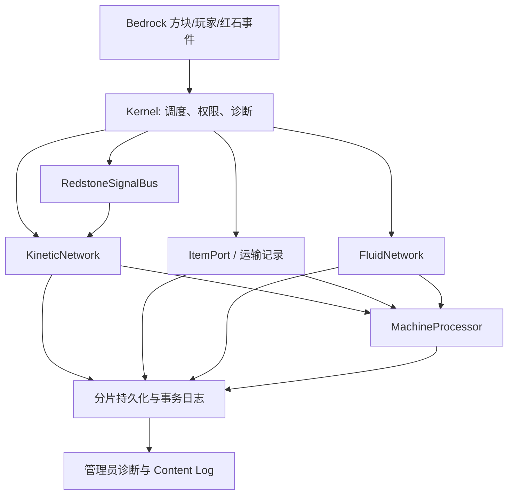

# Create Bedrock 阶段 3 完整详细设计

**状态：** 开发设计，未完成平台验收

**关联总规划：** `Create Bedrock / Realm 完整迁移规划与设计`

**目标基线：** Create 6.0.11 / Java 1.21.1；Bedrock 行为包当前声明最低 1.21.80
**阶段目标：** 完成静态系统的可扩展实现：动力、加工、基础物流、流体、红石，以及对应内容、配方、资源和迁移矩阵。

## 1. 阶段定义与完成条件

阶段 3 是“静态系统”阶段，不是完整 Create 发布阶段。它只处理固定在世界中的方块、物品、容器和网络；移动机械、蓝图和机械 actor 属于阶段 4，信号调度、包裹物流和高级列车属于阶段 5。

阶段 3 完成必须同时满足：

1. 已纳入阶段 3 的每个 Java identifier 都有规格、Bedrock identifier、资源清单、行为实现、存档版本和测试项。
2. 基础动力、加工、物流、流体和红石可以在服务端权威脚本中运行；任一脚本异常不得复制或吞没物品、流体或机器状态。
3. 源配方中属于已实现内容的条目全部有“已迁移”或明确的“平台阻塞”结论，不能以未分类条目代替完成。
4. Node 单测、包校验和构建通过；Windows、Realm、PS 的验收项须记录为待测，不能因当前没有环境而标为通过。

阶段 2 的 Windows/Realm/PS 硬闸门仍未验证。因此本阶段可以继续编码，但不得据此声称移动机械、列车或 Realm 已可发布。

## 2. 当前基线与范围校正

当前迁移矩阵有 362 个主注册项：185 个方块、114 个方块实体、54 个物品和 9 个实体。仅 30 个处于 `implementation_in_progress`，332 个仍为 `specification_pending`。仓库还识别到 1,884 个配方、2,449 个源资源和 2,567 个生成资源。

现有 Bedrock 包已提供手摇曲柄、水车、轴、齿轮、离合器、磨盘、压力机、粉碎轮、16 方块轴承原型及最小列车原型。它们是阶段 2 风险验证的基础，不等同于阶段 3 的全量实现。

现有矩阵没有 `phase` 字段，导致阶段 3 的通过条件无法准确计算：其中包含本应在阶段 4、5 实现的移动机械和列车内容。矩阵必须升级为 schema v2，并为每条记录增加下列字段：

```json
{
  "phase": 3,
  "domain": "logistics",
  "status": "specification_confirmed",
  "bedrockIdentifier": "createbedrock:andesite_funnel",
  "behaviorPath": "behavior_pack/scripts/logistics/funnel-runtime.js",
  "persistenceSchema": 1,
  "resourceStatus": "pending",
  "acceptanceId": "LOG-FUNNEL-001",
  "blockingReason": null
}
```

状态只允许为 `specification_pending`、`specification_confirmed`、`implementation_in_progress`、`static_verified`、`realm_accepted` 和 `blocked`。`blocked` 必须带原因、替代方案和重新评估版本；阶段 3 的统计只计算 `phase: 3`。

## 3. 范围

| 子系统 | 阶段 3 包含 | 后续阶段，不在本阶段声明完成 |
|---|---|---|
| 内核 | 调度、分片持久化、事务、诊断、迁移矩阵 | 全 Realm 压力调优与发布回滚演练 |
| 动力/加工 | 固定动力件、固定加工机、静态配方 | 附着在移动机械上的 actor |
| 物流 | ItemPort、传送带、漏斗、隧道、chute、depot、筛选和基础包裹接口 | 机械臂、移动库存、高级包裹路由 |
| 流体 | 储罐、管道、泵、固定端口、原版水/岩浆适配 | 软管滑轮、移动流体装置 |
| 红石 | 固定输入/输出、离合器和静态控制件 | 移动接触器、列车信号调度 |
| 资源 | 第一版直接转换/引用 Java 资源、语言、配方 | 重做模型、动画与教学体验 |

阶段 3 不允许为降低工作量而删除 Create 行为；尚不能实现的能力必须保留在矩阵中并标为阻塞，而非伪装为完成。

## 4. 目标架构



所有决定物品、流体、速度、配方、碰撞和存档的逻辑都在行为包服务端执行。资源包只负责模型、贴图、动画、语言和可视状态；客户端不得拥有可导致不同步或复制物品的权威状态。

### 4.1 调度与预算

`kernel` 为每类工作维护独立队列，使用稳定的轮转顺序。最低任务组为 `persistence`、`kinetics`、`processing`、`logistics`、`fluids`、`redstone` 和 `cleanup`。每组每 tick 都有固定预算；遍历连通网络、扫描配方或清理运输记录必须拆成可恢复的小任务，禁止全世界扫描。

每个任务必须是幂等的：同一任务重复执行不重复扣除物品或流体。任何异常由调度器记录为诊断并隔离，不能中断其他组。每个子系统至少上报队列长度、活跃节点数、延迟任务数、失败次数和最近错误。

### 4.2 分片持久化

当前原型把动力、列车、移动结构和机器列表分别写入单一 World Dynamic Property。阶段 3 必须改为 `ShardedStateStore`；现有 `DeferredPersistence` 继续负责 20 tick 合并写入和异常重试。

每个持久化域使用两代提交：

```text
createbedrock:state_root_v1              # 小型根指针，仅保存活跃 generation
createbedrock:state_g<generation>_i<n>   # 固定大小的索引页
createbedrock:state_g<generation>_s<n>   # 有校验和的数据分片
```

写入顺序为：生成新数据分片 → 写入索引页 → 最后更新根指针。根指针是提交点；任一步失败时恢复逻辑仍读取上一代已提交索引。成功后，`cleanup` 组异步删除旧 generation。每个数据分片采用项目保守上限 12 KiB 字符串预算，不依赖未验证的平台极限；超过预算即继续分割，并在诊断中报警。

分区规则如下：

- 动力节点、机器、端口、流体储罐：`dimension + 16×16×16 section`。
- 皮带、管道连接：按字典序较小端点所在 section 保存，避免双写。
- 静态移动结构快照：按轴承锚点 section 保存；超过分片预算时按部件序号拆分。
- 运输中的物品和流体：按当前运输 section 保存；事务日志单独按事务 id 分片。
- 轨道图维持既有 chunk 图结构；阶段 5 将其接入同一分片存储，不在阶段 3 重写列车行为。

每个分片封装为：

```json
{
  "schemaVersion": 1,
  "domain": "logistics",
  "partition": "minecraft:overworld:3:-2:4",
  "revision": 42,
  "checksum": "deterministic-content-hash",
  "records": []
}
```

恢复时先校验 schema、分区、校验和和记录类型；单个坏分片只冻结受影响的节点并输出诊断，不清空同域其他分片。首次升级必须读取旧 `*_v1` 单属性快照，生成新分片并仅在根指针提交后删除旧键。迁移需要覆盖“中断在写入前、索引前、根提交后”三种测试。

### 4.3 物品事务与基础物流

物流的核心不是直接在脚本里复制 `ItemStack`，而是 `ItemPort` 和持久化 escrow（托管）记录。端口适配器覆盖原版容器、Create 容器、depot、传送带入口/出口、漏斗和 chute。每个端口暴露：

```text
inspect() -> 可读槽位快照和 revision
reserve(request) -> 不改变库存的候选计划
extract(reservation) -> 取得托管物品或失败
insert(escrow) -> 接收全部或部分物品
rollback(escrow) -> 回到原端口或安全缓冲区
```

一次转移按以下状态机运行：

1. 读取源端口、目标端口和过滤器，生成包含槽位指纹的计划。
2. 先写入 `intent` 日志；再核对源槽位仍与计划一致。
3. 从源容器移除物品，并将完整序列化的物品置为 `escrowed`；此时 escrow 是唯一权威所有者。
4. 向目标端口插入；全部成功则提交并删除日志，部分成功则保留剩余 escrow。
5. 重启恢复扫描未完成事务：目标已确认则提交，否则重试插入；无法插入则退回源端口，最后才进入管理员可诊断的安全缓冲区。

Bedrock `Container` 和 `ItemStack` 调用可能因无效容器或规则而抛错，因此适配器必须在每次读写后验证结果，异常只能触发 rollback，不能生成掉落物作为“补偿”。物品序列化需要保留 type、amount 和支持的动态属性/命名数据；无法安全表示的物品被端口拒绝并输出原因。传送带中的物品使用 `TransportRecord`，而非无主 Item entity，保证单一所有权和可恢复性。

筛选器实现为纯函数策略：白名单/黑名单、精确物品、标签、优先级和红石锁定。所有策略必须在 Node 测试中覆盖“目标满、两个输入并发、脚本异常、重启恢复、相同物品合并和自定义数据不合并”。

### 4.4 动力与固定加工

动力实现继续以 `KineticNode`、端口邻接表和分量重算为核心。阶段 3 扩展时，每个固定方块必须显式声明轴向、输入/输出端口、传动比、应力供给/消耗、红石状态、资源状态和持久化版本；不能依赖“相邻方块类型猜测”实现隐式连接。

加工机统一通过 `MachineProcessor` 和事务输出：

```text
输入 ItemPort -> 配方匹配 -> 动力/流体工作量 -> 输出 escrow -> 输出 ItemPort
```

机器的进度、输入占用、随机结果种子和待交付输出都属于持久状态。随机副产物必须在开始处理时固定种子或预先决策，避免重启后重复抽取。配方导入器对每一项输出 `migrated`、`unsupported_dependency` 或 `manual_specification`；不存在静默跳过。

### 4.5 流体

Create 专用流体使用虚拟流体记录，不把任意数量直接转换为世界水方块。基础数据模型为 `FluidStack(typeId, amount, temperature, tags)`、`FluidTank(capacity, contents)` 和 `FluidPort`。所有抽取、插入和管道流动复用物品事务的 intent/escrow/commit 思路。

`FluidNetwork` 只在连接、阀门、泵、压力源或需求变化时标脏。调度器在每 tick 预算内传播定量流量；网络未完全求解时保留上一次稳定结果，不能凭空创建余量。水和岩浆通过原版世界适配器受限抽取/放置；适配器失败时保留流体而非修改世界。储罐、管道、机械泵、喷口、盆和加热源的具体 identifier、容量和配方必须先进入 phase-3 矩阵。

### 4.6 红石与版本闸门

红石使用 `RedstoneSignalBus`，把原版输入转为 `(location, face, level, tick)` 事件；设备订阅后更新离合器、阀门、漏斗锁定、比较器输出和控制逻辑。事件只标脏，不直接进行长网络重算。

这里存在明确的版本闸门：当前 manifest 的最低引擎为 1.21.80，而官方文档显示 `minecraft:redstone_producer` 需至少 1.21.120，`minecraft:redstone_consumer` 在 format 1.26.0 才解除实验限制。因此阶段 3 开始红石内容前必须作出以下决策之一：

1. 将目标最低 Bedrock/Realm 版本提升到对应的稳定版本，并在 Windows、Realm、PS 验证；或
2. 为当前 1.21.80 目标实现不依赖实验组件的兼容适配层，并将无法等价的设备标为 `blocked`。

不得在正式包中启用实验开关来掩盖该问题。`RedstoneSignalBus` 的接口先保持与具体 Bedrock 组件解耦，避免未来升级时扩散重写。

## 5. 内容、配方与资源迁移

第一版遵循“直接迁移，不重做设计”的决定。资源工具以明确清单从 `src/main/resources/assets/create` 读取输入，输出到 `bedrock/resource_pack` 并写入 provenance；禁止批量复制整个 Java assets 目录。直接元素模型继续使用现有转换器；父模型组合、OBJ、动画部件和无法映射的渲染效果建立逐项转换任务，不能用临时立方体声称视觉完成。

每个阶段 3 方块/物品至少需要：BP 定义、RP 客户端实体或几何、贴图、语言键、创造物品组/获取路径、配方、掉落规则、矩阵记录和最小测试。资源 id 与已发布 UUID 永久稳定；重做资源只替换 RP 文件，不能更改 BP identifier 或持久化 schema。

配方迁移按依赖拓扑执行：基础材料 → 动力件 → 容器/物流 → 流体 → 红石。导入报告必须区分原版可表达配方、需脚本配方、依赖缺失内容和兼容模组配方。兼容内容不能伪映射为原版物品。

## 6. 开发包与顺序

| 编号 | 交付物 | 静态退出条件 |
|---|---|---|
| S3-0 | 矩阵 schema v2、phase 标注、资源/配方基线 | 所有记录都已分配阶段和功能域 |
| S3-1 | `ShardedStateStore`、双代提交、旧状态迁移 | 分片、失败、重启和恢复单测通过 |
| S3-2 | `ItemPort`、物品事务、escrow、过滤器 | 无复制/吞没的事务测试通过 |
| S3-3 | depot、chute、funnel、belt 的基础物流纵切 | 容器到容器、满库存、锁定和恢复测试通过 |
| S3-4 | 固定动力件与加工机扩展、配方转换 | 每个支持方块有行为和配方映射 |
| S3-5 | `FluidTank`、管道、泵和世界流体适配 | 容量守恒、断网、重启测试通过 |
| S3-6 | `RedstoneSignalBus` 和已获版本批准的设备 | 不依赖实验 API，或矩阵明确阻塞 |
| S3-7 | 内容/RP 补全、诊断、性能收敛 | `validate`、`build`、矩阵检查全通过 |

实现顺序必须是 S3-0 → S3-1 → S3-2；物流、加工、流体和红石可在事务内核稳定后并行推进。S3-0 已完成矩阵 schema v2 基线；S3-1 已将动力和三类固定加工机从单一大属性迁移到 `ShardedStateStore`，并通过静态恢复测试。该结论不覆盖阶段 4/5 的移动结构和列车，也不替代 Windows、Realm、PS 平台验收。

当前实现已将动力和三类固定加工机迁移到分片存储，并提供 S3-2 的 `ItemPort`、筛选策略、持久化 intent/escrow 状态机与恢复测试。S3-3 已增加 depot 的受控持久化端口：depot 状态、抽取回执和 escrow 日志写入同一提交域，因而可在重启恢复时避免两端重复或吞没物品。`TransportRecord` 已实现 belt 上的唯一物品所有权、速度/反转、满端重试和重启恢复；尚未绑定到可放置的 belt 连接器或渲染。漏斗在前后两侧均为 depot 时按朝向自动建立无筛选端点；溜槽在正上、正下均为 depot 时自动建立垂直端点。两者在端点缺失时不会创建事务。原版 `Container` 适配层已支持普通可堆叠 `ItemStack`，并将无法无损重建的自定义数据、非堆叠物品拒绝在物流系统外；它尚未接入玩家/原版容器的持久化回执。S3-5 已开始实现与 Bedrock API 解耦的虚拟流体内核：`FluidTank` 保证容量与单液体兼容性，`FluidPort` 表达端口方向和接收策略，`FluidTransferJournal` 将抽取、escrow、部分交付、重试与重启恢复写成可测试事务。`FluidNetwork` 已实现端口间受预算限制的有向 pipe/pump 链接、阀门/泵状态、脏链路调度和 escrow 重启恢复；每次流动严格分为持久化 intent、抽取至 escrow、交付三步，同一源端口同时只允许一个活动事务，避免两个链接在持久化前竞争相同流体。端口库存变化必须显式标脏，以避免逐 tick 全图扫描。`FluidNetworkState` 将 tank、pipe/pump 和流体 escrow 记录按 tank 所在 section 或事务分区写入 `ShardedStateStore`；恢复中遇到缺失/损坏拓扑会冻结流体域，避免用不完整状态覆盖 escrow。第一条世界纵切已注册 Fluid Tank、Fluid Pipe 和 Mechanical Pump：Tank 放置/破坏会更新状态，朝向 pipe/pump 仅在其前后两侧均为 Tank 时创建链接，pump 读取现有 kinetic 网络速度决定运行。资源采用 Java 单体 tank、pipe item 与 pump 模型直接转换。Tank 现在支持玩家手持原版水桶或岩浆桶的单桶存取：交互前仅取消原版行为并冻结计划，下一 tick 重新核对选中槽、方块、Tank 和背包后才以 `Container.setItem` 结算；库存写入失败会尝试补偿 Tank。仅无标签、无温度的虚拟水/岩浆允许转为原版桶，避免丢失无法由原版桶表示的元数据。世界端口契约现在可精确识别 `liquid_depth: 0` 的水/岩浆源、拒绝水淹和流动液体，并在写入异常且读回状态冲突时报告 `uncertain`，不会猜测成功。但它尚未接到持久化 `FluidNetwork`：在引入可恢复的世界 escrow 占位标记前，不能删除原版水源后再声称崩溃安全。该纵切仍不等同 Java Create 的完整流体系统：pipe 尚无多分支无向拓扑，Tank 尚无多方块合并/可见液面，且未实现可从管网调用的世界水源/岩浆源抽取或放置。红石配置筛选、原版容器端点，以及可见 belt 仍未完成；当前 depot 会拒绝被破坏，直到库存与活动事务均为空。

## 7. 测试与验收

| 层级 | 现在可执行 | 必测内容 |
|---|---|---|
| Node 单测 | 是 | 图、分片、schema 升级、事务、过滤器、容量守恒、配方快照 |
| 静态包校验 | 是 | JSON、UUID、identifier、引用、资源、迁移矩阵、实验 API 扫描 |
| 构建/打包 | 是 | 可重复构建、资源 provenance、`.mcaddon` 结构 |
| Windows Bedrock | 否，待环境 | 包加载、Content Log、交互、原版容器、区块卸载、重启 |
| Realm/PS | 否，待环境 | 双人并发、长时间运行、资源下载、手柄、重启恢复 |

每个 S3-* 开发包至少新增正向、失败、重启和并发四类 Node 测试。Windows 测试开始后，必须启用 Content Log；任意 Error、Warning、脚本异常、事务未恢复或动态属性容量报警都会阻止 Realm 上传。Realm 验收至少覆盖两名玩家同时转移、区块边界、服务器重启、背包/容器满载、网络断开和 30 分钟压力运行。

## 8. 诊断、兼容与风险处理

管理员诊断至少输出：持久化 generation、分片数/字节数、未提交事务、回滚次数、队列长度、各网络节点数、活跃运输记录、流体总量和被阻塞的矩阵条目。日志禁止输出玩家库存完整内容或其他敏感信息。

主要风险和处理原则：

- **动态属性容量或写入失败：** 以分片、双代提交、退避重试和容量诊断处理；不能清空全局状态恢复运行。
- **原版容器不是跨容器原子事务：** 以持久化 escrow 记录保证唯一所有权；恢复程序优先完成或回滚。
- **Bedrock API 与目标版本不一致：** 每个新 API 标注最低版本和实验状态；`validate` 增加扫描规则。
- **资源转换不完整：** 矩阵分别记录逻辑、模型、贴图和动画；任一缺失均不算视觉完成。
- **缺少 Windows 环境：** 继续做纯逻辑和静态包验证，但所有平台项保留 `pending_platform_validation`。

## 9. 下一步实施清单

1. 修改矩阵生成器并添加 schema v2 校验，完成 S3-0 的 phase/domain 基线。
2. 实现 `ShardedStateStore`，先迁移动力和固定加工机，再迁移物流和流体；保留旧 v1 读取路径。
3. 建立 `ItemPort`、ItemStack 序列化、事务 journal 与恢复测试。
4. 以 depot → funnel/chute → belt 的顺序交付第一条端到端物流链。
5. 在红石实现前完成最低 Bedrock 版本决策，并记录到 manifest、矩阵和测试计划。

## 10. 外部依据

- [World Dynamic Properties API](https://learn.microsoft.com/en-us/minecraft/creator/scriptapi/minecraft/server/world?view=minecraft-bedrock-stable)
- [Container API](https://learn.microsoft.com/en-us/minecraft/creator/scriptapi/minecraft/server/container?view=minecraft-bedrock-stable)
- [ItemStack API](https://learn.microsoft.com/en-us/minecraft/creator/scriptapi/minecraft/server/itemstack?view=minecraft-bedrock-stable)
- [Redstone Producer block component](https://learn.microsoft.com/en-us/minecraft/creator/reference/content/blockreference/examples/blockcomponents/minecraftblock_redstone_producer?view=minecraft-bedrock-stable)
- [Bedrock 1.26 Creator update notes](https://learn.microsoft.com/en-us/minecraft/creator/documents/update1.26.0?view=minecraft-bedrock-stable)
